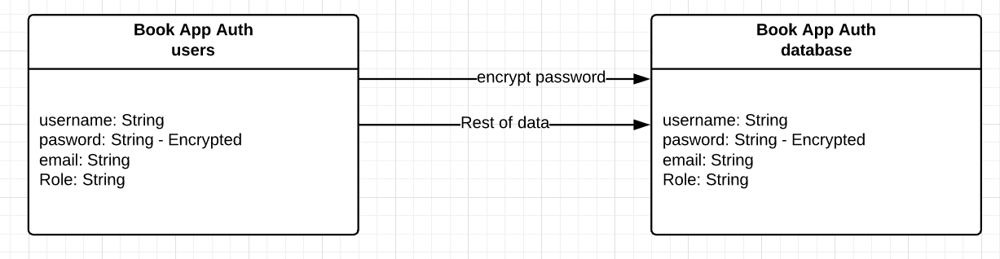

# Lab-11 Authentication

### Author: Felipe Delatorre and Matt Wilkin

### Links and Resources

[Submission PR](https://github.com/mwilkin-401-advanced-javascript/lab-11/pull/1)

[Travis](https://www.travis-ci.com/mwilkin-401-advanced-javascript/lab-11)

[Heroku](https://hidden-lake-68893.herokuapp.com/)

* UML 

### Documentation

Dependencies

  bcrypt
  cors 
  debug 
  dotenv
  eslint
  express
  jest
  jsonwebtoken
  mongodb-memory-server
  mongoose
  mongoose-schema-jsonschema
  morgan
  require-directory
  supertest
  swagger-ui-express

Modules

Exported Values and Methods

### Setup

Running the app
npm start

### Tests
How do you run tests?
npm test

What assertions were made?
What assertions need to be / should be made?

_________________
_________________

Project Guidelines